# Task API

A small CRUD API for managing a to-do list, built with **Node.js + Express**, backed by a **SQLite** database (`better-sqlite3`).

This started as an in-memory API (Assignment 1, W2·A1) and was upgraded in Assignment 2 (W3·A1) to persist data in a real database — the API itself didn't change, only the storage layer behind it.

## How to install & run

```bash
npm install
npm start
```

The server starts on **http://localhost:3000**.
Interactive Swagger docs are at **http://localhost:3000/docs**.

The database file `tasks.db` is created automatically the first time the app runs — no manual setup needed. The `tasks` table is created if missing, and the 3 example tasks are inserted only if the table is empty, so restarting the server never duplicates or wipes real data.

## Run the whole stack with Docker (BE-04)

Requires [Docker Desktop](https://www.docker.com/products/docker-desktop/) to be running.

```bash
cp .env.example .env      # .env is gitignored; .env.example is committed
docker compose up --build
```

The API is then on **http://localhost:3000** (Swagger at `/docs`), same as before. Stop it with `Ctrl+C`, or run in the background with `docker compose up -d --build`.

**How it's wired**

| File | Role |
|------|------|
| `Dockerfile` | Builds the app image (Node 22, installs dependencies inside the Linux image) |
| `docker-compose.yml` | Starts the app, loads `.env`, and mounts the named volume `task-data` at `/data` |
| `.env` / `.env.example` | `DB_PATH=/data/tasks.db` — where the SQLite file lives inside the container |
| `.dockerignore` | Keeps the host's `node_modules` out of the image (a Windows build of `better-sqlite3` would break on Linux) |

**Why no separate database container:** SQLite is a single file, not a server, so there is nothing to run "next to" the app. The database lives on a Docker **volume** instead, which is what makes the data outlive the container. (Q&A confirmed SQLite is acceptable for this assignment; the brief's Postgres container would be the equivalent step for a client/server database.)

**What changed vs. Assignment 2 (honest version):** only `db.js`, which now reads the file path from `DB_PATH` instead of hard-coding `tasks.db`. `index.js` — every route and all validation — is untouched. The "swap the in-memory store for a real repository" step was already done in Assignment 2, when the array was replaced by SQLite behind the same API.

### Proving persistence across app + container restarts

```bash
docker compose up -d --build
curl -X POST http://localhost:3000/tasks -H "Content-Type: application/json" -d '{"title":"Survives Docker"}'
curl http://localhost:3000/tasks                 # note the new task

docker compose restart                           # restart the app container
curl http://localhost:3000/tasks                 # still there

docker compose down                              # remove the container entirely
docker compose up -d                             # brand-new container, same volume
curl http://localhost:3000/tasks                 # still there
```

The task survives because it is stored in the `task-data` volume, not in the container's own filesystem. (`docker compose down -v` would delete the volume and wipe the data — that is the one command that resets it.)

**Actual output (full stack verified end-to-end):**
```
$ cd FlyRank-task-api

$ curl -X POST http://localhost:3000/tasks -H "Content-Type: application/json" -d '{"title":"Survives Docker"}'
{"id":4,"title":"Survives Docker","done":false}

$ curl http://localhost:3000/tasks
[{"id":1,...},{"id":2,...},{"id":3,...},{"id":4,"title":"Survives Docker","done":false}]

$ docker compose restart
 - Container flyrank-task-api-app-1 Restarting

$ curl http://localhost:3000/tasks
[...,{"id":4,"title":"Survives Docker","done":false}]   # still there after restart

$ docker compose down
 ✔ Container flyrank-task-api-app-1 Removed
 ✔ Network flyrank-task-api_default Removed

$ docker compose up -d
 ✔ Network flyrank-task-api_default Created
 ✔ Container flyrank-task-api-app-1 Started

$ curl http://localhost:3000/tasks
[...,{"id":4,"title":"Survives Docker","done":false}]   # still there after full container removal + recreation
```

## Why SQLite

SQLite needs no separate database server — it's a single file (`tasks.db`) that the app reads and writes directly. That makes it a good fit for a learning project: no install, no connection string, no server process to manage, and the whole database can be copied, inspected, or deleted like any other file. The API layer doesn't know or care that SQLite is behind it — swapping to PostgreSQL or MySQL later would only mean changing `db.js`, not any route handler.

## Where the database lives

`tasks.db`, in the project root, next to `index.js`. It's excluded from git via `.gitignore` — a database file is generated data, not source code, so it isn't committed to the repo.

## Endpoints

Identical to Assignment 1 — the whole point of this assignment is that the API contract didn't change:

| Method | Path          | Description                          | Success | Errors |
|--------|---------------|---------------------------------------|---------|--------|
| GET    | `/`           | API info                              | 200     | —      |
| GET    | `/health`     | Health check                          | 200     | —      |
| GET    | `/tasks`      | List all tasks                        | 200     | —      |
| GET    | `/tasks/:id`  | Get a single task                     | 200     | 404    |
| POST   | `/tasks`      | Create a task (`{ "title": "..." }`)  | 201     | 400    |
| PUT    | `/tasks/:id`  | Update a task's `title` and/or `done` | 200     | 400, 404 |
| DELETE | `/tasks/:id`  | Delete a task                         | 204     | 404    |
| GET    | `/stats`      | *(extra)* Counts of total/done/open, via SQL `COUNT()` | 200 | — |
| POST   | `/reset`      | *(extra)* Reset to the 3 seed tasks   | 200     | —      |

## Example: creating a task, then proving it survives a restart

```bash
curl -i -X POST http://localhost:3000/tasks \
  -H "Content-Type: application/json" \
  -d '{"title":"Buy milk"}'
```
```
HTTP/1.1 201 Created
{"id":4,"title":"Buy milk","done":false}
```
Stop the server (Ctrl+C), run `npm start` again, then `GET /tasks` — task 4 is still there. In Assignment 1, it would have vanished.

## Exploring the database directly (Stage 4)

Opened `tasks.db` and ran queries directly against it, outside the API:

```sql
SELECT * FROM tasks WHERE done = 1;
```
```
[
  { id: 1, title: 'Buy milk', done: 1 },
  { id: 3, title: 'Finish assignment', done: 1 }
]
```
Changing rows this way and then calling `GET /tasks` through the API immediately reflects the change — confirming the API and the database are reading the same underlying data, not a cached copy.

## Database screenshot

Explored the database directly using DB Browser for SQLite:

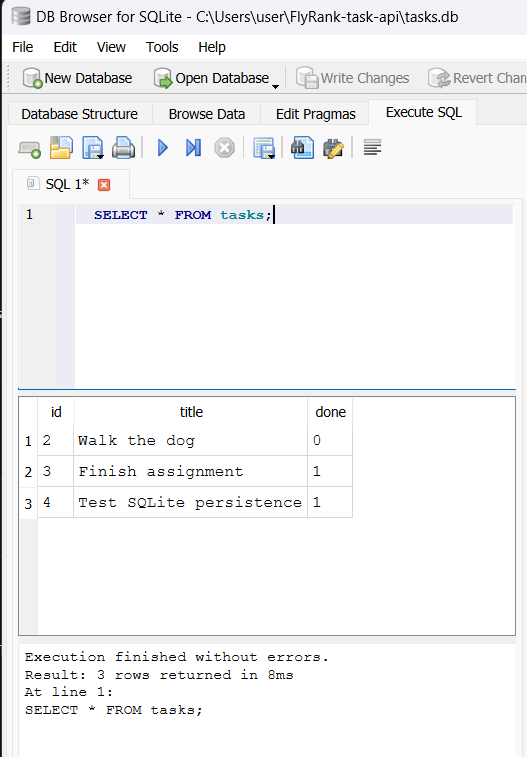
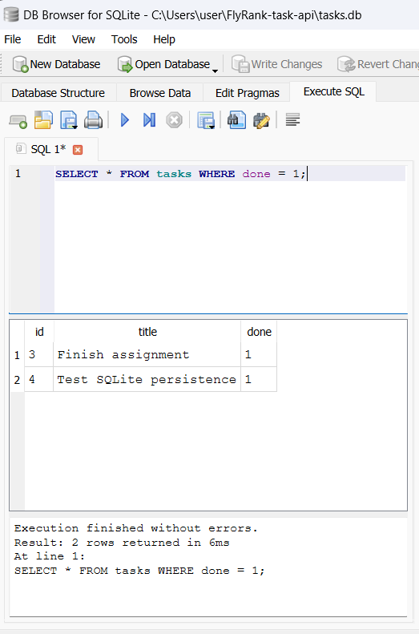
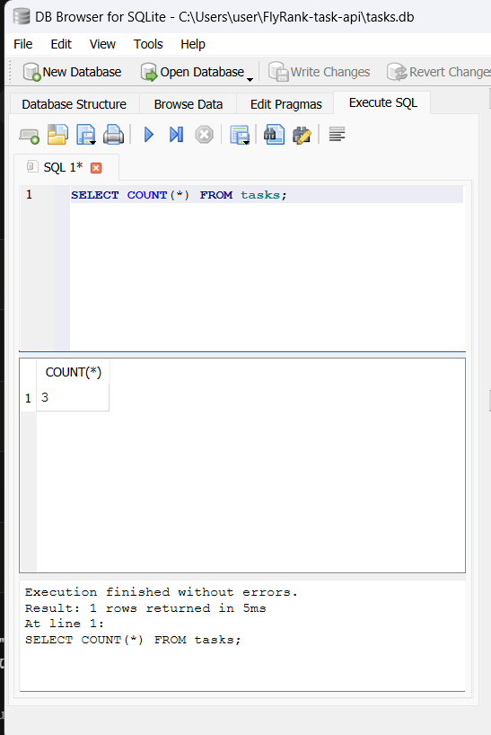
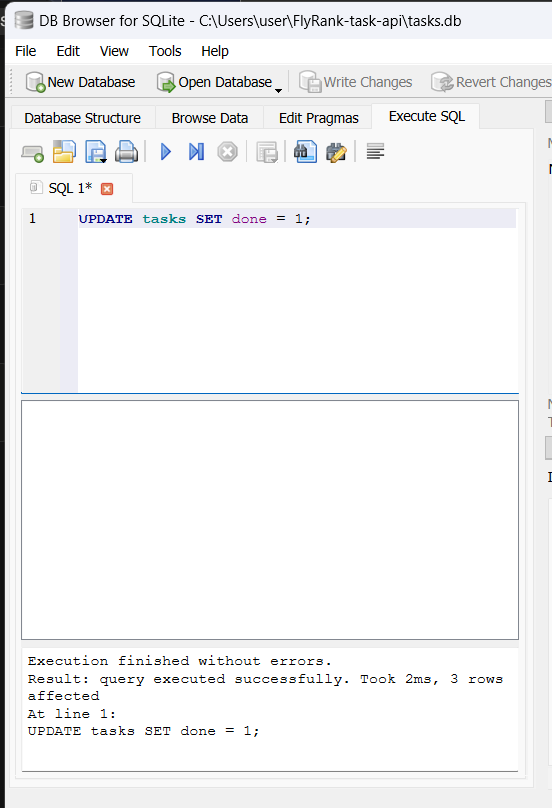

## Swagger screenshot

Full CRUD cycle tested through Swagger UI's "Try it out", now backed by SQLite:

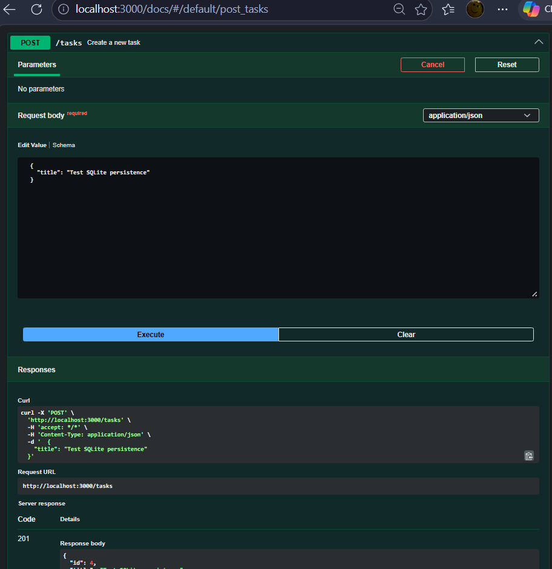
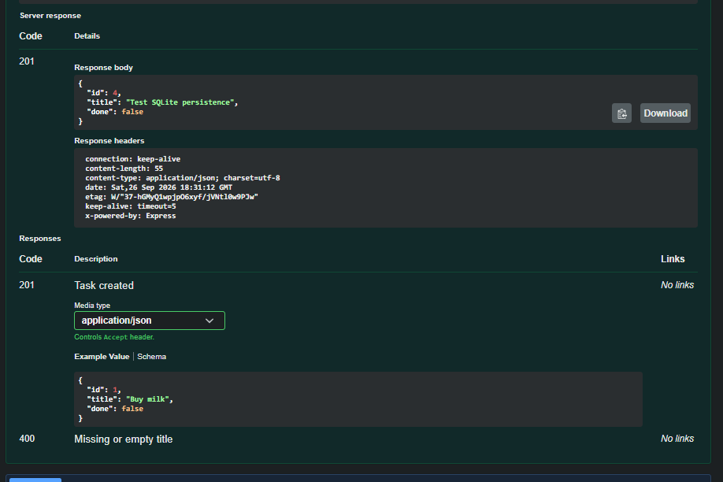
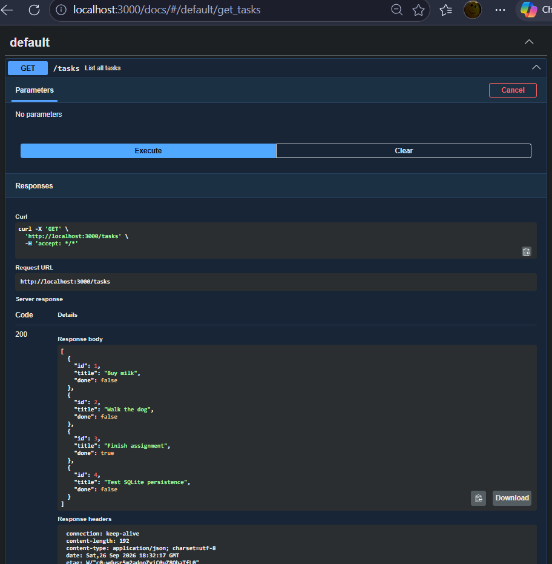
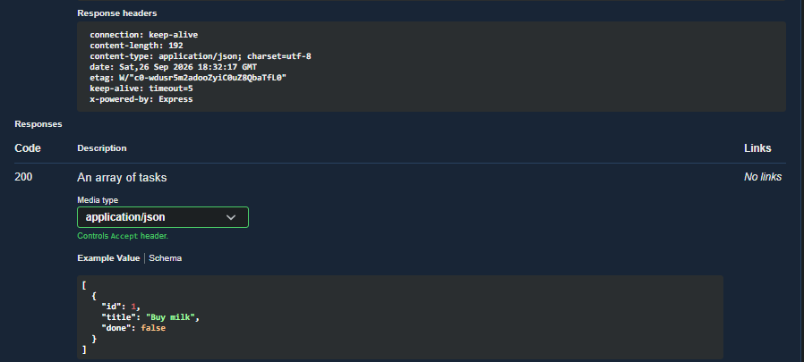
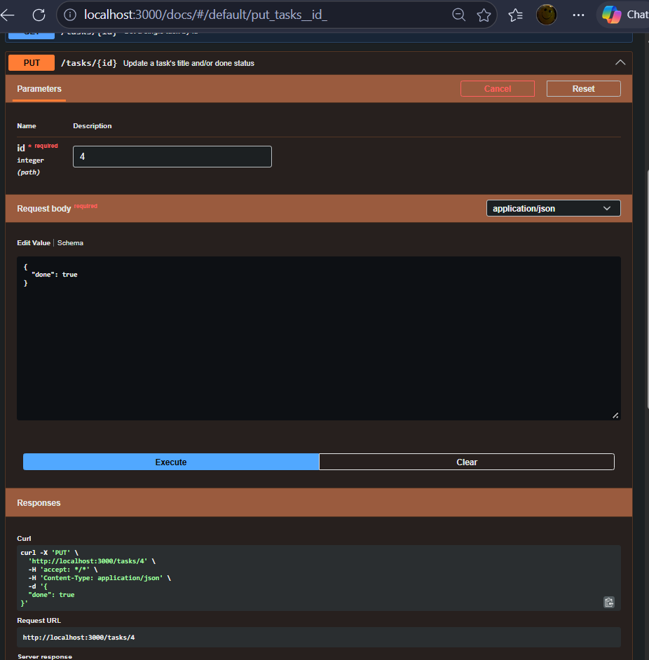
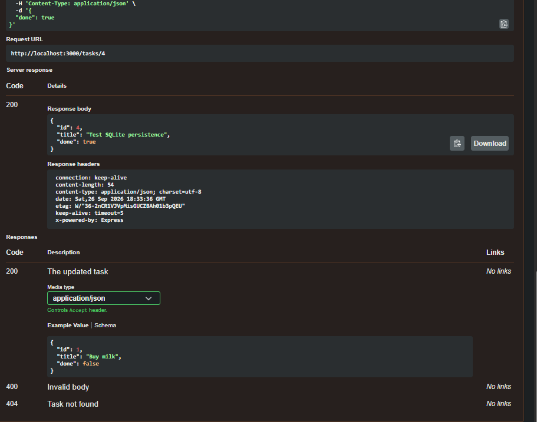
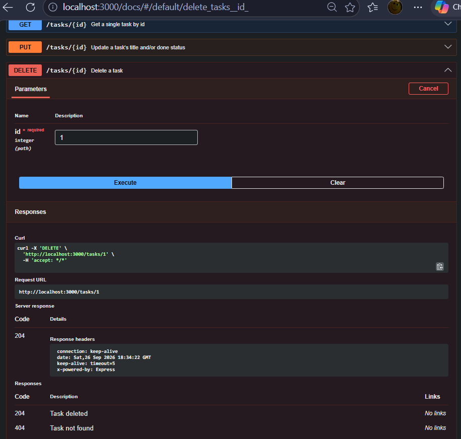
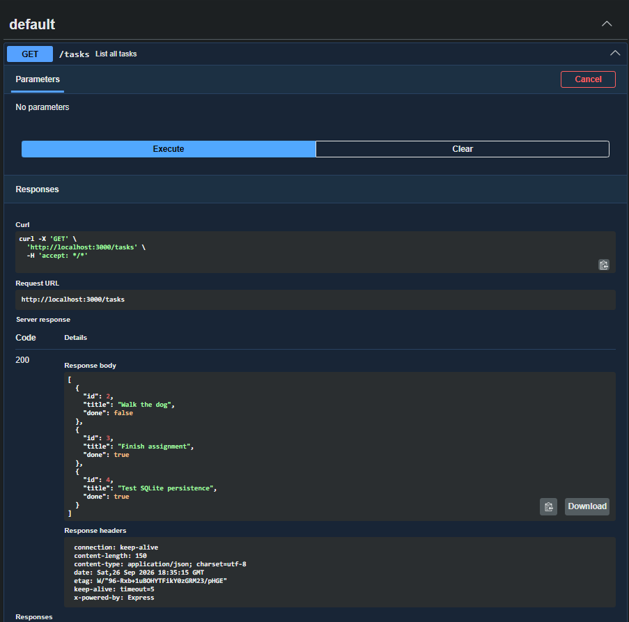

## The persistence experiment

Unlike Assignment 1, restarting the server no longer clears the task list. All tasks created, updated, or deleted are still exactly as left after a full restart, because they now live in `tasks.db` on disk instead of a JavaScript variable in memory. The array in Assignment 1 disappeared because it lived only in RAM, which the operating system reclaims the moment the process exits; SQLite writes every change straight to the file, so the data outlives the process that wrote it.

## AI vs me

_(If you do the bonus AI rematch stage, put your prompt, the AI's code, and your three differences here.)_
