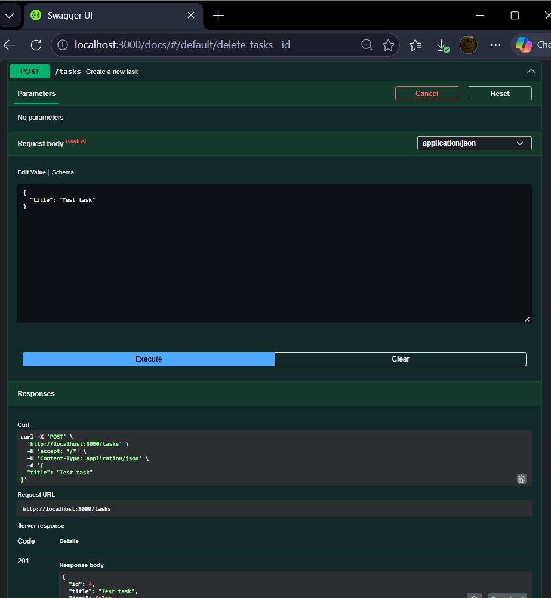
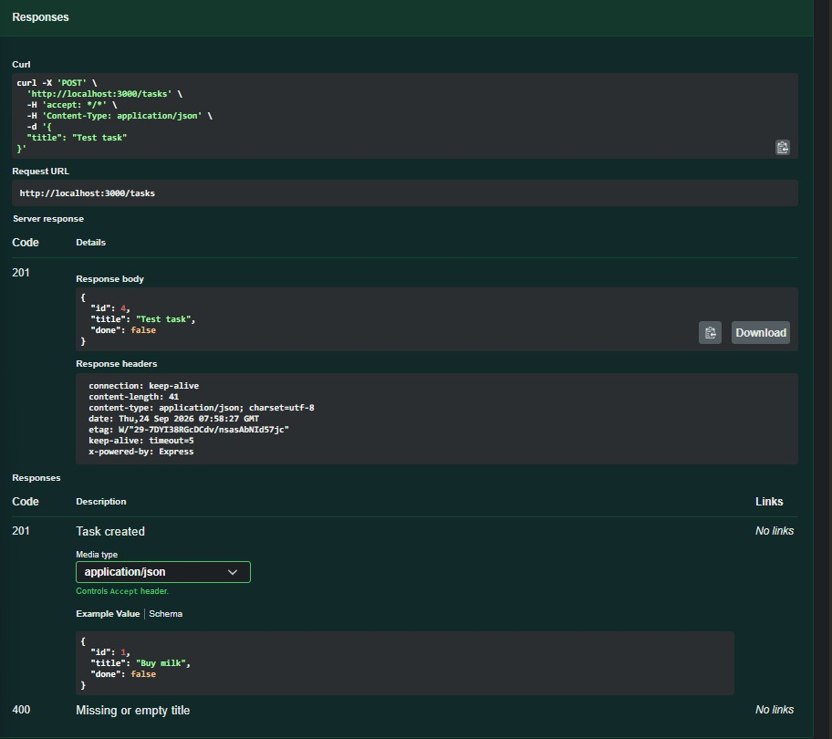
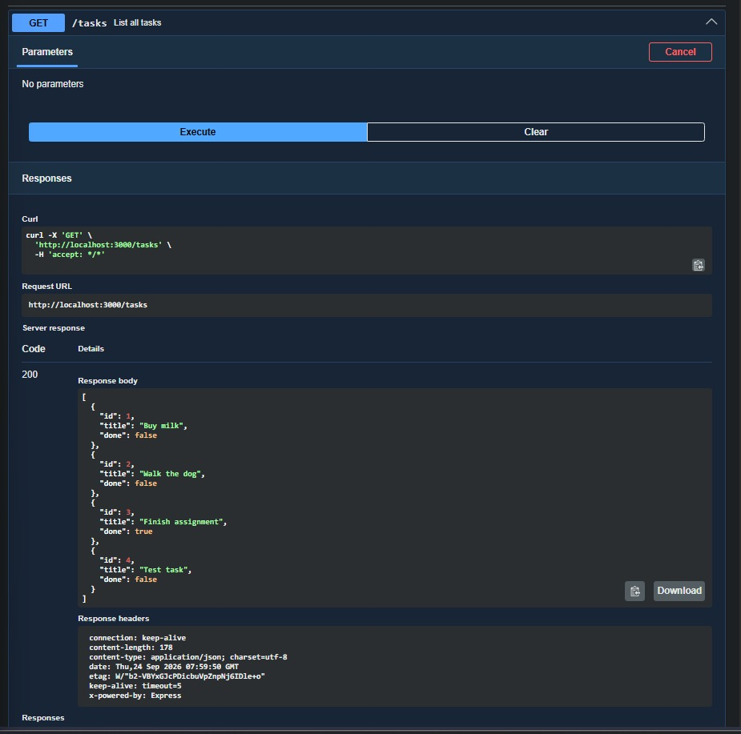
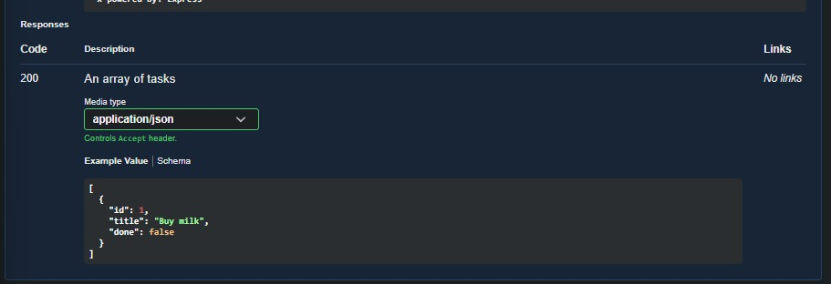
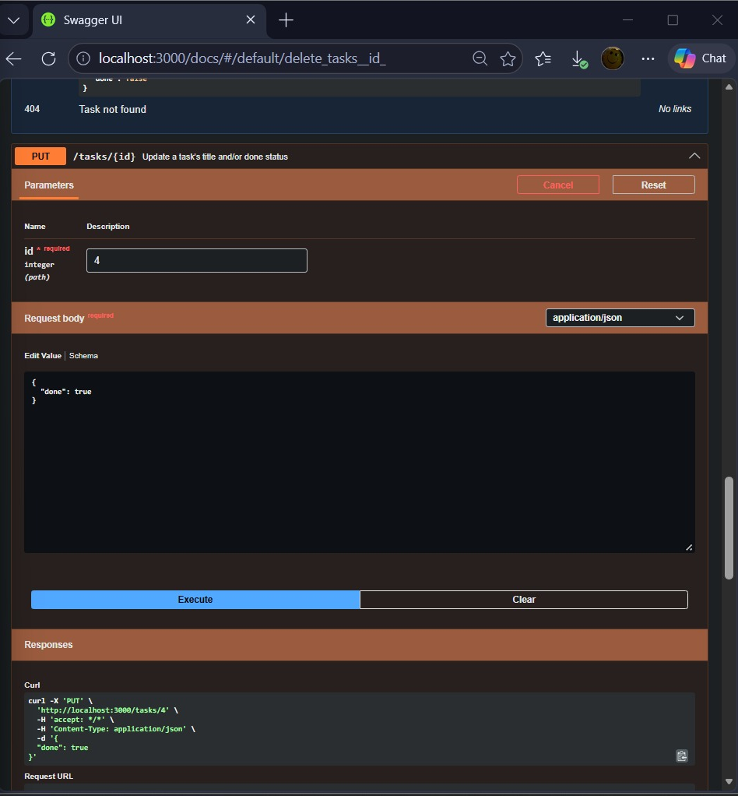
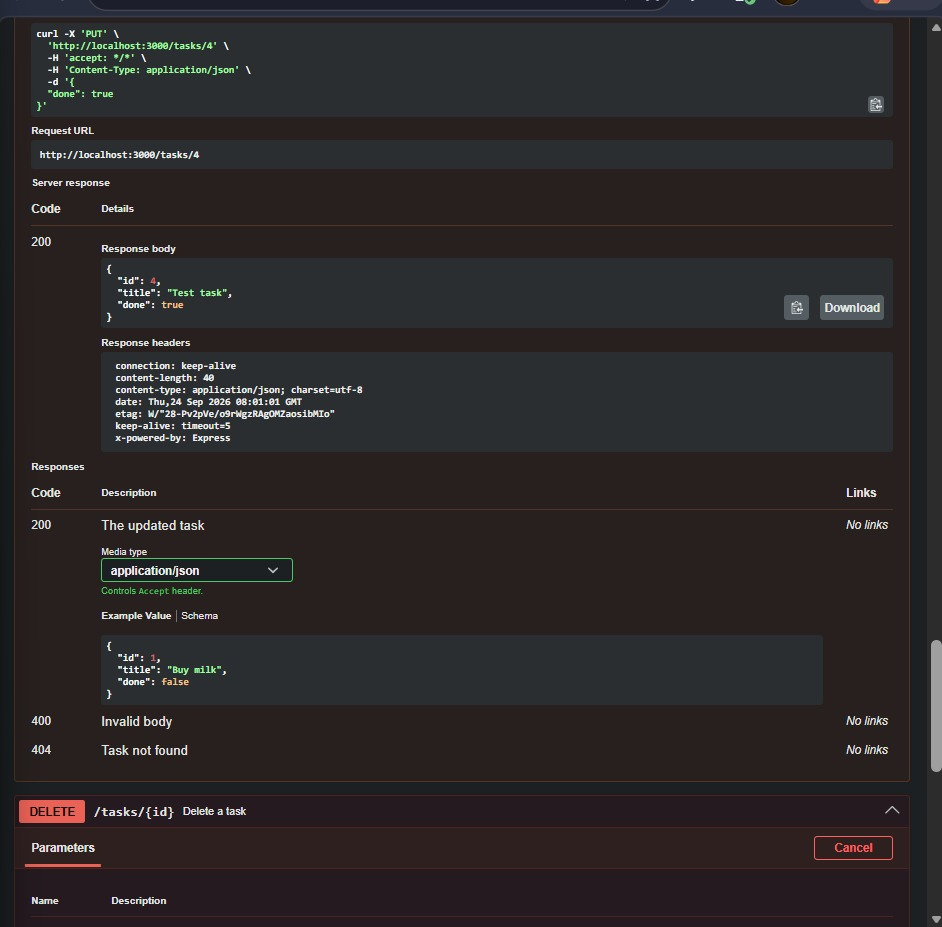
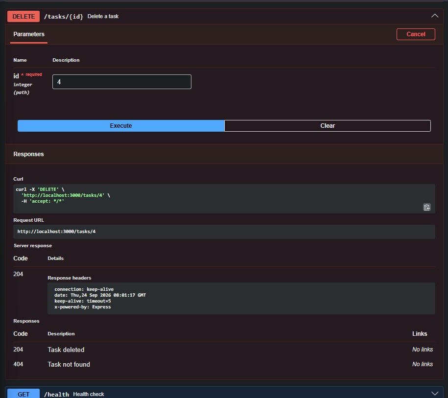
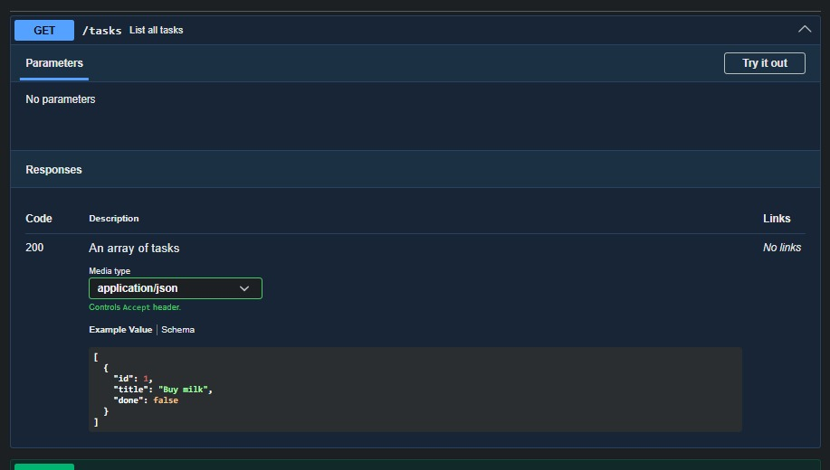

# Task API

A small CRUD API for managing a to-do list, built with **Node.js + Express**.
Data is stored **in memory** — it resets to 3 seed tasks every time the server restarts.

## How to install & run

```bash
npm install
npm start
```

The server starts on **http://localhost:3000**.
Interactive Swagger docs are at **http://localhost:3000/docs**.

## Endpoints

| Method | Path          | Description                          | Success | Errors |
|--------|---------------|---------------------------------------|---------|--------|
| GET    | `/`           | API info                              | 200     | —      |
| GET    | `/health`     | Health check                          | 200     | —      |
| GET    | `/tasks`      | List all tasks                        | 200     | —      |
| GET    | `/tasks/:id`  | Get a single task                     | 200     | 404    |
| POST   | `/tasks`      | Create a task (`{ "title": "..." }`)  | 201     | 400    |
| PUT    | `/tasks/:id`  | Update a task's `title` and/or `done` | 200     | 400, 404 |
| DELETE | `/tasks/:id`  | Delete a task                         | 204     | 404    |
| GET    | `/stats`      | *(extra)* Counts of total/done/open   | 200     | —      |
| POST   | `/reset`      | *(extra)* Reset to the 3 seed tasks   | 200     | —      |

## Example: creating a task

```bash
curl -i -X POST http://localhost:3000/tasks \
  -H "Content-Type: application/json" \
  -d '{"title":"Buy milk"}'
```

```
HTTP/1.1 201 Created
Content-Type: application/json; charset=utf-8

{"id":4,"title":"Buy milk","done":false}
```

## Swagger screenshot

Full CRUD cycle tested through Swagger UI's "Try it out":










## The mortality experiment

After restarting the server, all tasks I had created, updated, or deleted were gone — 
GET /tasks only showed the original 3 seed tasks again. This happens because the data 
was stored in memory (a JavaScript array), and memory is wiped clean every time the 
program (and the server process) restarts. This is exactly why real applications need 
a database — to make data survive restarts.

## AI vs me

_(If you do Stage 7, put your prompt, the AI's code, and your three differences here.)_
